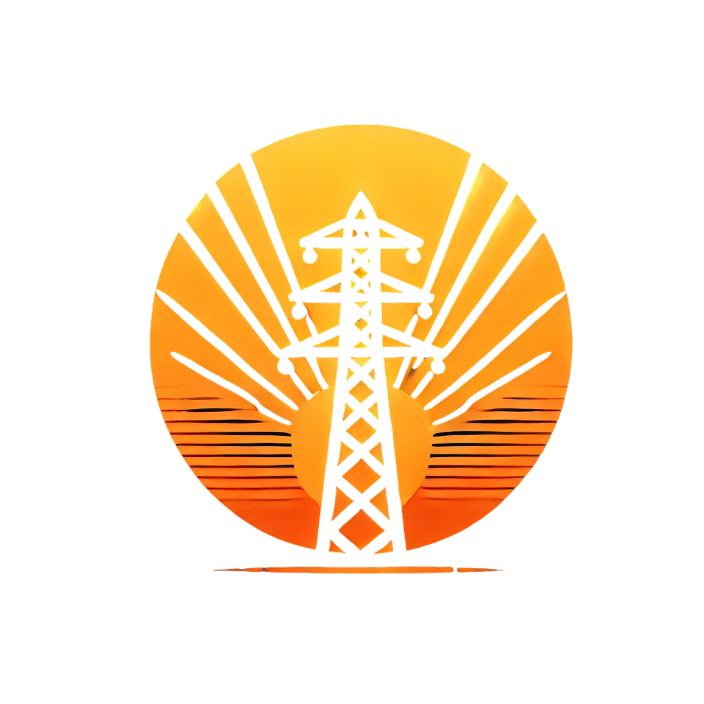

<h1 align="center">Solar Weather Monitoring System</h1>

   

  
 

   

  ## 📋 Table of Contents
  - [Our Idea](#idea)
  - [Presentation](#docs)
  - [Documentation](#docs)
  - [Team](#collaborators)
  - [Technologies](#technologies)

   

## 💡 Our Idea 
Our objective is to develop a monitoring system for solar weather events such as solar flares, solar energetic particles (SEPs), geomagnetic storms, and ionospheric disturbances. The system aims to provide real-time alerts and impact simulations for different industries like space agencies, aviation, and power grids to better prepare for these events.

   

#### 

## 📄 Presentation 
[Presentation](https://codingburgas-my.sharepoint.com/:p:/r/personal/vbkanev22_codingburgas_bg/_layouts/15/Doc.aspx?sourcedoc=%7BB5BC1692-AC33-4FFD-9152-80E7E8F22CEB%7D&file=InfraDash.pptx&action=edit&mobileredirect=true&wdOrigin=OFFICE-OFFICE-METAOS.FILEBROWSER.FILES-FOLDER)

   

## 📄 Documentation 
## 1. Solar Flares:
What: Sudden bursts of electromagnetic radiation (X-ray/UV light) from the Sun, often linked to CMEs.
Why Alert:
Cause radio blackouts (GPS, aviation communication).
Can damage satellites or disrupt power grids if extreme.
Key Metrics:
Class (B, C, M, X): X-class flares are the strongest.
Peak X-ray flux (measured by GOES satellites).
Data Sources:
NASA’s GOES X-ray Flux data.
Solar Dynamics Observatory (SDO) imagery.
## 2. Solar Energetic Particle (SEP) Events:
What: High-energy protons ejected during solar flares or CME shocks.
Why Alert:
Radiation risk for astronauts, high-altitude aviation, and satellites.
Can cause "single-event upsets" (memory errors) in electronics.
Key Metrics:
Proton flux levels (≥10 MeV particles).
NOAA’s Solar Radiation Storm Scale (S1-S5).
Data Sources:
ACE satellite’s EPAM instrument.
NOAA’s Space Weather Prediction Center (SWPC).
## 3. Geomagnetic Storms:
What: Disturbances in Earth’s magnetosphere caused by CMEs, solar wind, or coronal hole streams.
Why Alert:
Can induce currents in power grids (e.g., 1989 Quebec outage).
Disrupt satellite operations and radio communications.
Create auroras (a positive side-effect!).
Key Metrics:
Kp Index (0–9 scale, NOAA).
Dst Index (measures storm severity).
Data Sources:
DSCOVR satellite’s solar wind data.
Ground-based magnetometers (e.g., INTERMAGNET).
## 4. Coronal Hole High-Speed Streams (HSS):
What: Fast solar wind streams from open magnetic field regions on the Sun.
Why Alert:
Cause recurrent geomagnetic storms (weaker but longer-lasting).
Disrupt satellite drag and orbital tracking.
Key Metrics:
Solar wind speed (>500 km/s).
Bz component of the interplanetary magnetic field (IMF).
Data Sources:
NASA’s Solar Wind Prediction Model.
ACE or DSCOVR real-time solar wind data.
## 5. Ionospheric Disturbances:
What: Disruptions in Earth’s ionosphere caused by solar flares or particle events.
Why Alert:
Can degrade GPS accuracy and HF radio signals.
Impact aviation navigation and emergency communications.
Key Metrics:
Total Electron Content (TEC) maps.
Sudden Ionospheric Disturbance (SID) monitors.
Data Sources:
NASA’s Madrigal TEC database.
Global GNSS networks (e.g., IGS).

## 🌱 Team 
> 1. **Project Manager** - **VBKanev22**
   - ***GitHub profile***: [***VBKanev22***](https://github.com/VBKanev22)
> 2. **Front-end Developer** - **Oktay Mehmed**
   - ***GitHub profile***: [***Oktay Mehmed***](https://github.com/Akame1981)
> 3. **Back-end Developer** - **trephy**
   - ***GitHub profile***: [***trephy***](https://github.com/Trephyyy)

 

   

## ⚒️ Tools 

 

 
 

   

## 💻 Languages

 

